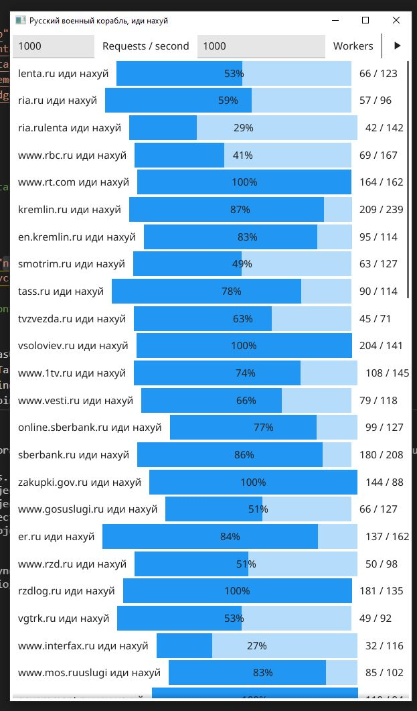

### Hi there 👋

This repository was created in order to help defend against Russia propaganda during the war activities of Russian armies in Ukraine 2022.

There are two variants of the program:
- GUI
- CLI

For GUI simply download the latest program for your operating system from the Releases section.
It is possible to run CLI program using Docker.

# Usage

- `RusskijKorablIdiNaxuj.exe.zip` for Windows platforms 
- `RusskijKorablIdiNaxuj.apk` for Android platforms 
- `RusskijKorablIdiNaxuj.tar.xz` for Linux platforms 
- Please build manually for Mac-OS. 

After executing the binary there will be a window similar to the one in the screenshot above. If you have a less formidable PC, then reduce "Workers" number to something like 500.
Then you can click on the little triangle on the right and start the process.

# Contribute targets

Either create an issue or a PR.
